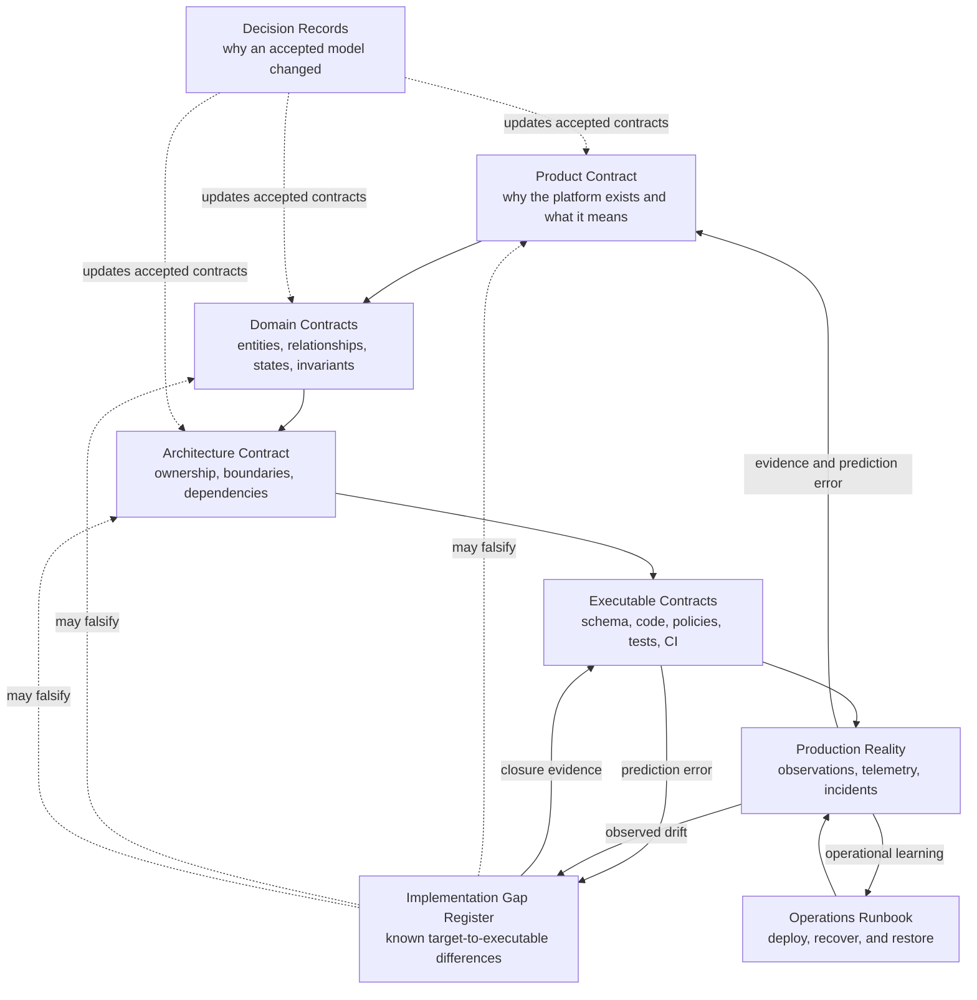

# Documentation Map

This directory separates product meaning, target design, domain semantics, known implementation gaps, operating procedures, implementation evidence, and decision history.

## Durable contract set

- [`PRODUCT.md`](./PRODUCT.md): canonical product meaning, semantic boundaries, invariants, deferred concepts, and falsification conditions.
- [`IMPLEMENTATION_GAPS.md`](./IMPLEMENTATION_GAPS.md): evidence-backed differences between target contracts and current executable behavior, including risk, containment, and closure evidence.
- [`architecture/`](./architecture/README.md): target architecture, ownership and dependency boundaries, invariants, and accepted ADRs.
- [`domains/`](./domains/README.md): candidate and accepted problem contracts. A document here does not create a package, service, or bounded context by itself.
- [`operations/RUNBOOK.md`](./operations/RUNBOOK.md): production release, recovery, incident, data-protection, and validation procedures.
- [`DEVELOPMENT_ENVIRONMENT.md`](./DEVELOPMENT_ENVIRONMENT.md): workstation bootstrap and deterministic local verification entry points.
- [`CODEX_DESKTOP.md`](./CODEX_DESKTOP.md): Codex Desktop project configuration, MCP context routing, trust boundaries, and verification.

## Design-to-production truth model

The diagram is a projection of the written contracts, not an independent source of truth.

## Question-specific authority

No single document is authoritative for every question.

| Question | Primary authority |
| --- | --- |
| What does the product mean? | `docs/PRODUCT.md` |
| What business problem, vocabulary, and invariants does a domain own? | Accepted domain contract, with Domain code and tests as implementation evidence |
| What are the target ownership and dependency boundaries? | `docs/architecture/README.md` and accepted ADRs |
| Where does current executable behavior differ from a target contract? | `docs/IMPLEMENTATION_GAPS.md`, backed by exact code, schema, policy, test, provider, or incident evidence |
| What is the current desired database structure? | `supabase/schemas/*.sql` |
| How did the database change over time? | Reviewed append-only migrations |
| What does the current implementation do? | Executable code, policies, and tests |
| What is actually happening in production? | Direct observation, provider telemetry, deployment evidence, and incident records |
| How should an operator release or recover the system? | `docs/operations/RUNBOOK.md`, after its preconditions are verified |
| How does an external dependency behave? | Current official documentation for that external system |

Generated diagrams, generated types, snapshots, agent output, and session context are projections or evidence. They cannot silently redefine the target model.

## Repository work instruction order

1. Current explicit task and the applicable `AGENTS.md` chain
2. Canonical product contract, accepted target contracts, and accepted ADRs
3. Registered implementation gaps and their containment or closure evidence
4. Executable code, schema, policies, migrations, and tests for current implementation behavior
5. Direct observations and current official external documentation
6. Generated projections and transient context

When target contracts and executable behavior disagree, do not hide the difference. Register the gap, identify whether the contract is wrong, implementation is incomplete, or production has drifted, then update the earliest invalid truth boundary.

An open authorization or data-integrity gap is not a roadmap note. It blocks claims that the affected capability is production-validated until the required closure evidence exists.

OpenAI Developer Docs, Context7, GitHub documentation, Supabase documentation, and other official sources answer questions about their respective external systems. They do not silently redefine this platform.
