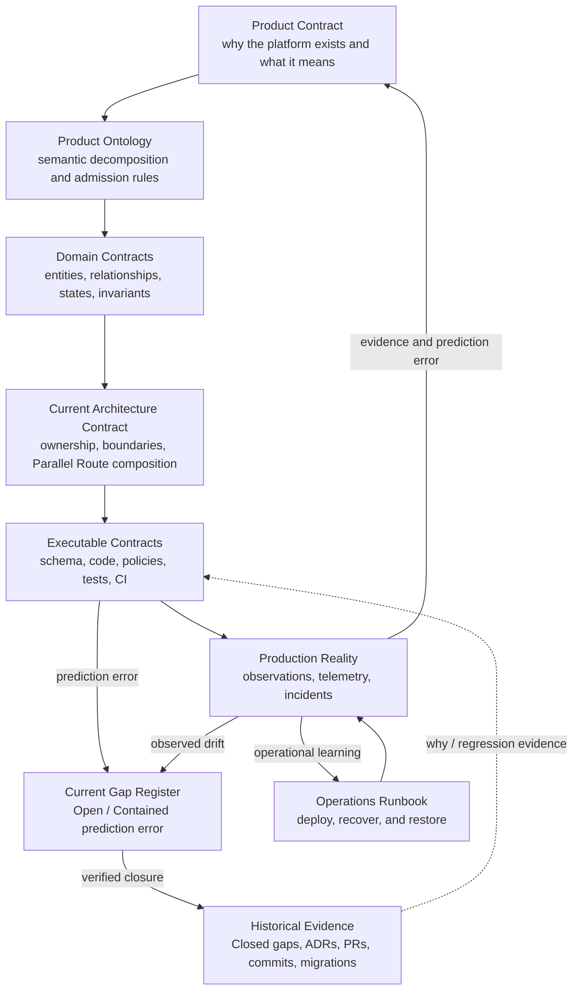

# Documentation Map

This directory separates current product/architecture truth from historical evidence so normal development does not need to interpret decision archaeology.

## Durable contract set

- [`PRODUCT.md`](./PRODUCT.md): canonical root product meaning, semantic boundaries, invariants, deferred concepts, and falsification conditions.
- [`ONTOLOGY.md`](./ONTOLOGY.md): canonical expansion of the Product Contract for GitHub semantic decomposition, the complete 1–22 ontology map, non-confusion boundaries, derivations, and admission rules. It does not replace `PRODUCT.md` as the root product contract.
- [`IMPLEMENTATION_GAPS.md`](./IMPLEMENTATION_GAPS.md): **current Open or Contained** differences between target contracts and executable behavior, including risk, containment, and required closure evidence.
- [`history/CLOSED_GAPS.md`](./history/CLOSED_GAPS.md): historical closure evidence for Closed or Superseded gaps. It is audit/regression evidence, not current implementation truth.
- [`architecture/README.md`](./architecture/README.md): current target architecture, ownership/dependency boundaries, and current Next.js Repository Parallel Route composition.
- [`architecture/ADR_INDEX.md`](./architecture/ADR_INDEX.md): decision-history router showing which ADR effects remain current and which historical details were superseded. Read it before individual ADRs.
- [`domains/`](./domains/README.md): candidate and accepted problem contracts. A document here does not create a package, service, or bounded context by itself.
- [`operations/RUNBOOK.md`](./operations/RUNBOOK.md): production release, recovery, incident, data-protection, environment-provisioning, and validation procedures.
- [`DEVELOPMENT_ENVIRONMENT.md`](./DEVELOPMENT_ENVIRONMENT.md): workstation bootstrap and deterministic local verification entry points.
- [`CODEX_DESKTOP.md`](./CODEX_DESKTOP.md): Codex Desktop project configuration, MCP context routing, trust boundaries, and verification.

## Design-to-production truth model

The diagram is a projection of the written contracts, not an independent source of truth.

## Question-specific authority

| Question | Primary authority |
| --- | --- |
| What does the product mean? | `docs/PRODUCT.md` |
| How should a GitHub-inspired concept be classified before it becomes an Entity/Relationship/Process/Projection? | `docs/ONTOLOGY.md`, under the root rules in `docs/PRODUCT.md` |
| What business problem, vocabulary, and invariants does a domain own? | Accepted Domain contract, with Domain code/tests as implementation evidence |
| What are the current target ownership, dependency, and Repository Parallel Route boundaries? | `docs/architecture/README.md` and executable route/checker contracts |
| Why was an architecture decision made, and which parts are still current? | `docs/architecture/ADR_INDEX.md`, then only the relevant ADR |
| Where does current executable behavior differ from a target contract? | `docs/IMPLEMENTATION_GAPS.md`, backed by exact executable/provider evidence |
| Why was a closed mismatch fixed this way, or what proved closure? | `docs/history/CLOSED_GAPS.md`, then the referenced ADR/PR/commit/CI evidence |
| What is the current desired database structure? | `supabase/schemas/*.sql` |
| How can an empty database be rebuilt? | Reviewed accepted migrations plus deterministic local seed data |
| Which migrations are applied in a persistent environment? | That environment's migration ledger and direct provider evidence |
| What does the current implementation do? | Executable code, policies, and tests |
| What is actually happening in production? | Direct observation, provider telemetry, deployment evidence, and incident records |
| How should an operator provision, release, or recover an environment? | `docs/operations/RUNBOOK.md`, after its preconditions are verified |
| How does an external dependency behave? | Current official documentation for that external system |

Generated diagrams, generated types, snapshots, agent output, and session context are projections or evidence. They cannot silently redefine the target model.

A selected provider is not proof of a provisioned environment. A migration file is not proof of an applied migration. Local or CI verification is not production validation.

## Repository work instruction order

1. Current explicit task and the applicable `AGENTS.md` chain.
2. Canonical Product and Product Ontology, then the narrowest relevant Domain/current Architecture contract.
3. Current Open/Contained implementation gaps and their containment requirements.
4. Executable code, schema, policies, migrations, and tests for current behavior.
5. Direct observations and current official external documentation.
6. For decision history, read `architecture/ADR_INDEX.md` first and open only the relevant ADR; use Closed gaps/PRs/commits only when the task asks why, investigates a regression, or validates provenance.
7. Generated projections and transient context.

When target contracts and executable behavior disagree, do not hide the difference. Register the current gap, determine whether the contract is wrong, implementation is incomplete, or production drifted, then update the earliest invalid truth boundary.

An open authorization or data-integrity gap is not a roadmap note. It blocks claims that the affected capability is production-validated until the required closure evidence exists.

OpenAI Developer Docs, Context7, GitHub documentation, Supabase documentation, and other official sources answer questions about their respective external systems. They do not silently redefine this platform.
