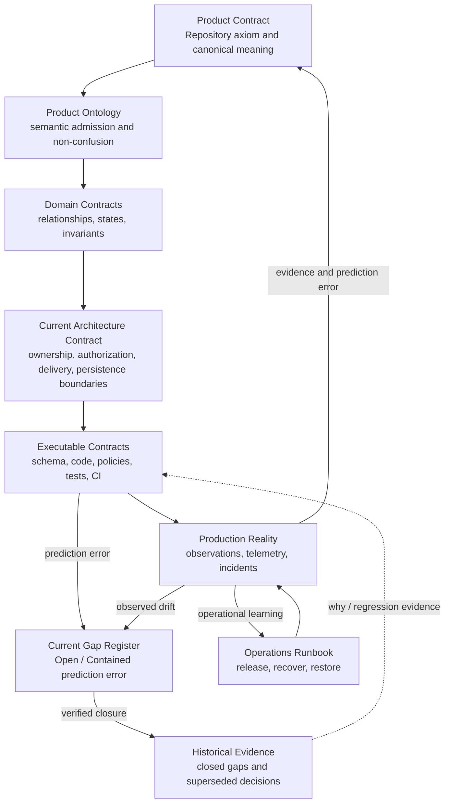

# Documentation Map

This directory separates current Product/Domain/Architecture truth from historical evidence so normal development does not need to interpret obsolete decisions.

## Durable contract set

- [`PRODUCT.md`](./PRODUCT.md): canonical root Product axiom, meanings, invariants, deferred concepts, and falsification conditions.
- [`ONTOLOGY.md`](./ONTOLOGY.md): canonical semantic expansion and GitHub benchmark-admission rules. It does not replace `PRODUCT.md` as the root Product Contract.
- [`IMPLEMENTATION_GAPS.md`](./IMPLEMENTATION_GAPS.md): current Open or Contained differences between target contracts and executable behavior, including risk, containment, and required closure evidence.
- [`history/CLOSED_GAPS.md`](./history/CLOSED_GAPS.md): historical closure evidence for Closed or Superseded gaps; never current implementation truth by itself.
- [`architecture/README.md`](./architecture/README.md): current target architecture, ownership/dependency boundaries, owner-neutral authorization, and canonical `/{owner}/{repository}` Web architecture.
- [`architecture/ADR_INDEX.md`](./architecture/ADR_INDEX.md): decision-history router showing Accepted, Historical, and Superseded architecture decisions.
- [`domains/`](./domains/README.md): candidate and accepted business problem contracts. A document here does not create a package, service, or bounded context by itself.
- [`operations/RUNBOOK.md`](./operations/RUNBOOK.md): production release, recovery, incident, data-protection, environment-provisioning, and validation procedures.
- [`DEVELOPMENT_ENVIRONMENT.md`](./DEVELOPMENT_ENVIRONMENT.md): workstation bootstrap and deterministic local verification entry points.
- [`CODEX_DESKTOP.md`](./CODEX_DESKTOP.md): Codex Desktop project configuration, MCP context routing, trust boundaries, and verification.

## Design-to-production truth model



The diagram is a projection of the written contracts, not an independent source of truth.

## Question-specific authority

| Question | Primary authority |
| --- | --- |
| What does the Product mean? | `docs/PRODUCT.md` |
| How should a GitHub-inspired concept be admitted/classified before implementation? | `docs/ONTOLOGY.md`, constrained by `docs/PRODUCT.md` |
| What business problem, vocabulary, and invariants does a Domain own? | Narrowest relevant Domain contract plus Domain tests as executable evidence |
| What are current ownership, dependency, authorization, URL, and Repository presentation boundaries? | `docs/architecture/README.md` and executable route/checker contracts |
| Why was an architecture decision made, and is it still current? | `docs/architecture/ADR_INDEX.md`, then only the relevant ADR |
| Where does current executable behavior differ from target? | `docs/IMPLEMENTATION_GAPS.md`, backed by exact executable/provider evidence |
| What is current desired database structure? | `supabase/schemas/*.sql` |
| How can an empty database be rebuilt? | Reviewed replayable migrations plus deterministic seed data |
| Which migrations are applied in a persistent environment? | That environment's migration ledger and direct provider evidence |
| What does current implementation do? | Executable code, policies, and tests |
| What is actually happening in production? | Direct observation, provider telemetry, deployment evidence, and incident records |
| How should an operator provision, release, or recover an environment? | `docs/operations/RUNBOOK.md` after verifying its preconditions |
| How does an external dependency behave? | Current official documentation for that external system |

Generated diagrams, generated types, snapshots, agent output, and session context are projections or evidence. They cannot silently redefine the target model.

A selected provider is not proof of a provisioned environment. A migration file is not proof of an applied migration. Local or CI verification is not production validation.

## Current Repository truth

```text
Repository = No-Code Collaboration Container
Repository Owner = User | Organization
Canonical Repository URL = /{ownerSlug}/{repositorySlug}
/app = authenticated Repository discovery/dashboard
```

Canonical Repository presentation is one Owner/Repository header, primary navigation, and one active content surface.

A stable-ID compatibility route may resolve and redirect to canonical URL. An Organization-only Repository UI tree is not a valid current or compatibility representation.

## Repository work instruction order

1. Current explicit task and the applicable `AGENTS.md` chain.
2. Canonical Product/Ontology, then the narrowest relevant Domain/current Architecture contract.
3. Current Open/Contained implementation gaps and their containment requirements.
4. Executable code, schema, policies, migrations, and tests for current behavior.
5. Direct observations and current official external documentation.
6. For decision history, read `architecture/ADR_INDEX.md` first and open only the relevant historical record when the task asks why or investigates a regression.
7. Generated projections and transient context.

When target contracts and executable behavior disagree, do not hide the difference. Determine whether the earliest invalid boundary is Product, Domain, Architecture, executable projection, or environment evidence, then correct that boundary and every affected downstream projection.

An open authorization or data-integrity gap is not a roadmap note. It blocks claims that the affected capability is production-validated until required closure evidence exists.

OpenAI Developer Docs, Context7, GitHub documentation, Supabase documentation, and other official sources answer questions about their respective external systems. They do not silently redefine this platform.
